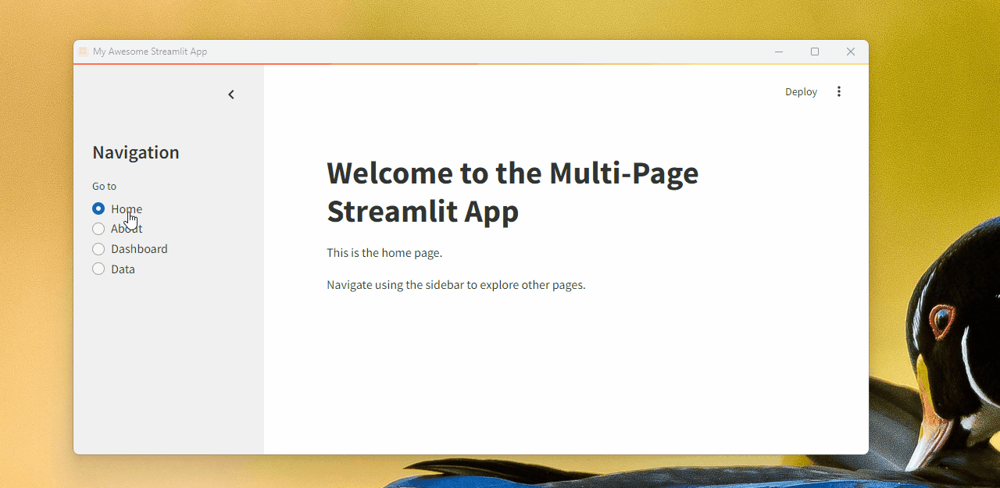

# Streamlit as Desktop Application

Packaging a Streamlit application into an executable file using PyInstaller presents certain challenges and is not officially endorsed by Streamlit. Streamlit is primarily designed for developing web applications that operate on a server and are accessed through a web browser. However, if you wish to proceed with this approach, follow the steps below.
```
.
└── StreamlitApp/
    ├── .streamlit/
    │   ├── config.toml
    │   └── ..
    ├── app/
    │   ├── assets/
    │   │   ├── apps.ico
    │   │   └── ..
    │   ├── home.py
    │   ├── about.py
    │   └── main_app.py
    ├── src/
    │   └── webgui.py
    ├── wheels/
    │   └── ...
    ├── main.py
    ├── installer.cfg
    └── requirements.txt
```

# Quick start
1. Clone the Repository: First, clone the repository containing the Streamlit application:
    ```bash
    git clone https://github.com/intel-sandbox/atm-omt-datamlg-streamlit-desktop-app
    cd atm-omt-datamlg-streamlit-desktop-app
    ```
2. Create and activate a new virtual environment:
    ```bash
    python -m venv venv
    venv\Scripts\activate  # On Windows
    # source venv/bin/activate  # On macOS/Linux
    ```
3. Install the required packages listed in requirements.txt:
    ```bash
    pip install -r requirements.txt
    ```
4. Download and install NSIS (Nullsoft Scriptable Install System) from the [NSIS website](http://nsis.sourceforge.net/Download)

5. Create a configuration file named installer.cfg with the following content:
    ```ini
    [Application]
    name=MyStreamlitApp
    version=1.0.0.0
    publisher=Manufacturing DataScience
    entry_point=main:main
    icon=app/assets/apps.ico

    [Python]
    version=3.12.3
    bitness=64

    [Include]
    pypi_wheels = altair==5.4.1
                attrs==24.2.0
                # Add other dependencies here
    files=.streamlit/
        app/
        src/
    ```
6. Run the following command to generate your installer. This command will create a build folder with the executable.
    ```bash
    pynsist installer.cfg
    ```
7. Handle Dependency Issues: If any dependencies are not found in the PyPI repository, you may encounter errors like:
    ```bash
    nsist.wheels.NoWheelError: No compatible wheels found for numpy 1.24.3
    ```
    To avoid this, manually download the wheels and place them in the wheels folder:
    ```bash
    pip wheel --wheel-dir wheels numpy==2.1.2
    ```
8. Install the Application
You can directly launch the application by running the .pyw file or install the application by running MyStreamlitApp.exe. Once the installation is completed, you should be able to find the app icon in the start menu and start the application as a native app.



# Important Considerations
- **Limitations**: This method may not be suitable for all scenarios and could have inherent limitations.
- **Dependency Verification**: Manually verify the final list of requirements to mitigate potential dependency issues.
